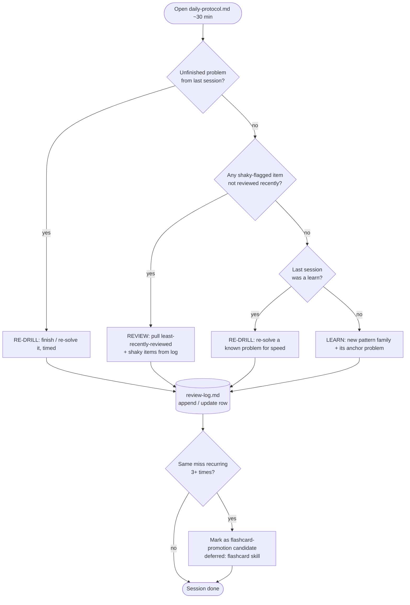
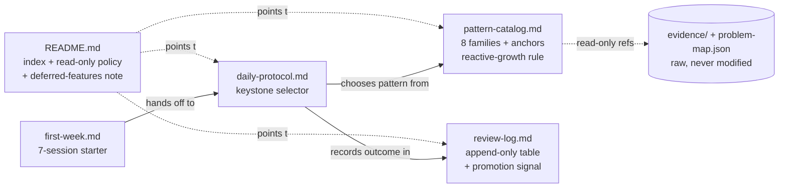

# feat: ARENA Interview Prep System (Doc-Driven v1)

## Summary

Build a lightweight, in-repo, **doc-driven** ARENA coding-test prep system, organized by *pattern* and sized for ~30 min/day. It centers on a dead-simple daily session protocol that rotates learn / re-drill / review by a flag-priority rule, backed by a small pattern catalog (8 starting families — the 6 the six seed problems directly touch plus two adjacent fundamentals — growing reactively) with the six ARENA problems as anchors, and an append-only plain-text review log that captures misses and recall cues. The plan delivers five markdown files under a new `prep/arena-interview-prep/study/` folder plus a first-week starter sequence and a manual validation checklist. No scripts, no automation, no external integrations. Flashcards, a timed simulator, and a reusable skill are deferred until the daily habit exists and real failure modes are visible.

This is a **planning** document. It defines the file layout, the content shape of each doc, decisions, and validation — it does not author the final prose of the docs themselves.

---

## Problem Frame

The user is applying to ARENA 9.0 (programme listed Oct 5–Nov 6 2026; application includes a one-hour, six-question coding test) and has never done LeetCode prep before. The binding constraint is time: ~30 min/day over roughly 100 days, so total practice is ~50 hours. At that budget, curation and retention are the levers, not volume grinding.

The six problems recovered from the August 2024 ARENA Slack thread are strong evidence of the test's *style* but are not a guaranteed question set; treating them as the syllabus risks memorizing the wrong six. The skill being trained is recognizing, under time pressure, which **pattern** a fresh problem maps to — and then producing the solution.

A secondary risk is over-building: spending the scarce prep window constructing prep infrastructure (flashcards, drill tooling, a skill) instead of practicing. This plan is deliberately a thin documentation layer.

(see origin: `docs/brainstorms/2026-06-26-arena-interview-prep-setup-requirements.md`)

---

## Key Technical Decisions

- **KTD1 — Location: sibling subfolder `prep/arena-interview-prep/study/`.** The active system nests beside the raw evidence so all ARENA material stays in one tree and catalog→evidence links stay short. The raw packet (`README.md`, `problem-map.json`, `evidence/`) is untouched. (Resolves the origin's "Resolve before planning" question; confirmed with user.)
- **KTD2 — Review log = single append-only markdown table in one file.** One `review-log.md` with a fixed column schema. A single scannable table makes recurring misses visible at a glance (R10), which is the trigger for later flashcard promotion. Chosen over one-file-per-entry (scatters the at-a-glance view) and JSON (not human-skimmable in ~seconds, and v1 has no tooling to render it). (Resolves origin deferred question; confirmed with user.)
- **KTD3 — Rotation = flag-priority adaptive rule, not a fixed weekly calendar.** "If a problem is unfinished from last session → re-drill it; else if anything is flagged shaky and stale → review; else alternate learn / re-drill." Carryover takes precedence (AE2), then review, then the learn/re-drill alternation — matching the HTD flowchart and U3. Lower daily friction and self-correcting toward weak spots; a fixed calendar would force review days with nothing to review and ignore carryover. (Resolves origin deferred question; confirmed with user.)
- **KTD4 — Catalog = 8 starting families (6 seed-touched + 2 foundational), grown reactively.** Seed the 8 starting families: the 6 the six anchors directly touch (stack simulation; greedy/math; prefix-suffix parity; bounded Hamming distance; game theory; LIS-from-both-sides) plus two-pointer/sliding-window and hashing as adjacent fundamentals the seeds lean on — landing in R1's ~8–12 band. Common fundamentals not touched by a seed (binary search, BFS/DFS) are listed as **named reactive-add candidates**, not pre-written entries, honoring R3 and YAGNI. (Resolves origin deferred question; confirmed with user.)
- **KTD5 — Plain-text retention first; Convex flashcards deferred.** All retention lives in the markdown log. The `flashcard` skill is documented as a future promotion step triggered by log-proven recurrence, not wired now (R11, scope boundary).
- **KTD6 — Reuse `problem-map.json` fields as catalog seed.** Each anchor's `pattern`, `invariant`, and `drill_target` map directly to the catalog's core-idea / cue / drill fields, avoiding re-derivation (R2).

---

## High-Level Technical Design

The system is five documents with a defined daily decision flow and outcome data-flow between them. The protocol is the entry point each day; the log is the memory; the catalog is the knowledge base.

**Daily decision flow (the rotation rule the protocol encodes, KTD3):**



**Document data-flow / responsibilities:**



Both diagrams render authoritative content for the docs being built; the per-unit sections below are the source of truth for exact fields.

---

## Output Structure

Greenfield directory; the per-unit `**Files:**` sections remain authoritative.

```
prep/arena-interview-prep/
├── README.md                 # EXISTING — raw packet, not modified
├── problem-map.json          # EXISTING — raw seed data, not modified
├── evidence/slack-2024-08/   # EXISTING — raw evidence, not modified
└── study/                    # NEW — the active doc-driven prep system
    ├── README.md             # index, 30-second how-to-use, read-only policy, deferred-features note
    ├── daily-protocol.md     # KEYSTONE: 3 day-types, flag-priority rotation, ~30-min sizing
    ├── pattern-catalog.md    # 8 starting families (6 seed-touched + 2 foundational); reactive-growth rule + add-candidates
    ├── review-log.md         # append-only markdown table + legend + worked example + promotion signal
    └── first-week.md         # concrete 7-session starter sequence, hands off to daily-protocol
```

---

## Requirements Traceability

| Req (origin) | Covered by |
| --- | --- |
| R1 catalog of ~8–12 families covering the seed patterns | U1 (pattern-catalog) |
| R2 each family: core idea, cue/invariant, 1–3 reps; six problems as anchors reusing `problem-map.json` | U1 |
| R3 catalog grows reactively | U1 (reactive-growth rule + add-candidates) |
| R4 single skimmable protocol answers "what today?" in seconds | U3 (daily-protocol) |
| R5 three day-types + rotation rule | U3 |
| R6 each day-type fits ~30 min; a Medium may span sessions | U3 |
| R7 protocol names where outcome is recorded | U3 → review-log link |
| R8 plain-text log: pattern, miss/slow, cue, shaky flag | U2 (review-log schema) |
| R9 review day pulls by least-recently-reviewed + shaky, not SRS | U2 + U3 |
| R10 log makes recurring misses visible → promotion trigger | U2 (promotion signal) |
| R11 docs + lightweight structured files only; no scripts/automation/external integration | whole plan (no `scripts/`, no code) |
| R12 existing evidence referenced, not modified | KTD1 + U5 read-only policy; no unit edits `evidence/`, `problem-map.json`, or the existing `README.md` |
| AE1 learn-day: knows pattern + anchor in ~1 min | U3, validated in checklist |
| AE2 unfinished Hard becomes tomorrow's re-drill, not a failure | U3 carryover rule |
| AE3 log a miss with cue + shaky; it resurfaces on review | U2 worked example + U3 review pull |
| AE4 recurring miss across weeks is visibly clustered → promote | U2 promotion signal |

---

## Implementation Units

### U1. Pattern catalog (`pattern-catalog.md`)

- **Goal:** Create the catalog of pattern families that organizes prep, with the six ARENA problems mapped as anchors and a rule for growing it reactively. Creates the `study/` folder.
- **Requirements:** R1, R2, R3; supports AE1.
- **Dependencies:** none.
- **Files:** create `prep/arena-interview-prep/study/pattern-catalog.md`.
- **Approach:**
  - One section per pattern family. Seed the families the six anchors touch (KTD4): **stack simulation, greedy/math, prefix-suffix parity, bounded Hamming distance, game theory (digit-sum imbalance), LIS-from-both-sides**, plus **two-pointer / sliding window** and **hashing** as foundational families the seeds lean on — landing in the R1 "~8–12" band without padding.
  - Each family records, in a fixed mini-shape: **Core idea** (1–2 lines), **Cue / invariant** ("when do I reach for this?"), **Representative problems** (1–3), and the **anchor(s)** among the six with a relative link to the local Python solution and the LeetCode URL.
  - Populate anchor fields directly from `problem-map.json` (`pattern` → core idea, `invariant` → cue, `drill_target` → a "drill focus" line, `local_paths.python` → link, `leetcode_url` → link). Use **relative** links to evidence/solutions (e.g., `../../../Python/sum-game.py`, `../evidence/slack-2024-08/06-question-5-sum-game.png`).
  - Add a short **"Growing this catalog (reactively)"** note (R3): add a family/problem only when a session exposes a gap; never enumerate up front. List **binary search** and **BFS/DFS** as *named reactive-add candidates* — explicitly not seeded now.
  - Note the `longest-mountain-in-array` (LC845) vs LC1671 discrepancy under the LIS family so the anchor target is unambiguous.
- **Patterns to follow:** mirror the table/field style already in `prep/arena-interview-prep/README.md` and the field names in `problem-map.json`.
- **Test scenarios:** `Test expectation: none -- documentation artifact; validated manually via the Validation Checklist (R1, R2, R3) and by confirming every anchor link resolves.`
- **Verification:** All 6 anchors appear under a family; each family has core-idea + cue + ≥1 representative; family count is 8 within R1's band; reactive-growth note present; every relative link resolves from the file's location.

### U2. Review log (`review-log.md`)

- **Goal:** Define the append-only plain-text log that captures per-problem misses, recall cues, and shaky flags, and makes recurrence visible for later flashcard promotion.
- **Requirements:** R8, R9 (schema side), R10; supports AE3, AE4.
- **Dependencies:** none.
- **Files:** create `prep/arena-interview-prep/study/review-log.md`.
- **Approach:**
  - A single markdown table with fixed columns: **Date | Problem (LC#) | Pattern family | What was missed / slow | Recall cue | Shaky? | Last reviewed**. Append-only; entries are never deleted, only updated (the "Last reviewed" cell and "Shaky?" flag change over time).
  - A short **Legend** above the table: `Shaky?` = `yes` / `ok`; "Last reviewed" = date of most recent review-day touch; pattern family must match a `pattern-catalog.md` family name (the cross-link that lets recurrence cluster).
  - One **worked example row** seeded from AE3: Sum Game (LC1927), pattern = game theory, miss = "forgot the odd-question-mark imbalance condition," cue = "who can offset the half-sum difference?", Shaky? = yes. This doubles as the format demonstration.
  - A **"Spotting promotion candidates"** subsection (R10, AE4): scan the *What was missed / Pattern family* columns; when the same invariant misses 3+ times across entries, mark it a flashcard-promotion candidate (the deferred `flashcard` skill is the target — link to the deferred-features note in README).
  - A **"How review day pulls from this log"** subsection (R9): the review day-type selects the least-recently-reviewed rows plus any `Shaky? = yes` rows — explicitly *not* a computed SRS interval. Cross-reference `daily-protocol.md`.
- **Patterns to follow:** plain GitHub-flavored markdown table; keep columns narrow enough to skim.
- **Test scenarios:** `Test expectation: none -- documentation artifact; validated manually via the Validation Checklist (R8, R9, R10) and the AE3/AE4 walkthroughs.`
- **Verification:** Table has all 7 columns; legend defines `Shaky?` and "Last reviewed"; AE3 example row present and well-formed; promotion-candidate rule and review-pull rule both stated; pattern-family column values reference catalog family names.

### U3. Daily session protocol (`daily-protocol.md`) — keystone

- **Goal:** Deliver the single skimmable doc that answers "what do I do in today's ~30 minutes?" in seconds, defining the three day-types, the flag-priority rotation, ~30-min sizing, and where outcomes are recorded.
- **Requirements:** R4, R5, R6, R7, R9 (selection side); satisfies AE1, AE2; links AE3 logging.
- **Dependencies:** U1 (references catalog families/anchors), U2 (references the log + review-pull rule).
- **Files:** create `prep/arena-interview-prep/study/daily-protocol.md`.
- **Approach:**
  - Open with a **"Do this now" block at the very top** (R4): a 4–6 line decision the user reads in seconds, encoding the rotation rule from the HTD flowchart (carryover → review-if-shaky-and-stale → else alternate learn/re-drill). The decision must require **no per-day planning** from the user.
  - **Three day-type sections**, each sized to ~30 min (R6):
    - **LEARN** — read one catalog family + its anchor's cue/invariant; attempt the anchor problem fresh; if unfinished at ~30 min, note "carry to re-drill" (this is the AE2 expectation, framed as normal, not failure). End by logging an entry.
    - **RE-DRILL** — re-solve a previously-seen problem from memory, timed, for speed and a clean implementation; if it was a carryover, finish it. Log slow points.
    - **REVIEW** — pull least-recently-reviewed + `Shaky?=yes` items from `review-log.md` (R9); for each, recall the cue, re-derive the invariant, optionally re-solve fast; update "Last reviewed" + flag; scan for promotion candidates.
  - **Rotation rule section** (R5, KTD3): state the flag-priority rule explicitly and give the carryover precedence (AE2). Keep it to a short ordered list matching the flowchart.
  - **"Where outcomes go" line** (R7): every session ends with a `review-log.md` append/update; link it.
  - **Beginner sizing note** (R6): a single new Medium may span more than one session; a Hard (the LIS anchor) likely spans several — this is expected, not behind schedule.
- **Patterns to follow:** keep the top "Do this now" block above the fold; terse imperative voice.
- **Test scenarios:** `Test expectation: none -- documentation artifact; validated manually via the Validation Checklist (R4–R7) and the AE1/AE2 walkthroughs (time the "what do I do?" decision).`
- **Verification:** Top-of-file decision block resolves a day-type in ≤~1 min with no planning (AE1); all three day-types defined and each plausibly ≤30 min; carryover/AE2 rule present; rotation rule matches the HTD flowchart; review-log link present.

### U4. First-week starter (`first-week.md`)

- **Goal:** Provide a concrete, no-decisions 7-session opening sequence that bootstraps the habit, then hands off to the steady-state protocol.
- **Requirements:** supports R4 (zero-friction start) and the first-week-rollout deliverable; exercises AE1/AE2 on real anchors.
- **Dependencies:** U1 (catalog families/anchors), U3 (day-types + handoff).
- **Files:** create `prep/arena-interview-prep/study/first-week.md`.
- **Approach:**
  - A fixed 7-session table: **Session | Day-type | Pattern / problem | Why now**. Order anchors easy → hard to build confidence:
    1. LEARN — stack simulation, Removing Stars (LC2390) — easiest anchor.
    2. LEARN — greedy/math, Maximum Score From Removing Stones (LC1753).
    3. RE-DRILL — re-solve LC2390 timed.
    4. LEARN — prefix/suffix parity, Ways to Make a Fair Array (LC1664).
    5. REVIEW — first review pass over logged items (seeds the review habit even if thin).
    6. LEARN — bounded Hamming distance, Words Within Two Edits (LC2452).
    7. RE-DRILL / catch-up — re-solve a shaky one or finish any carryover.
  - Defer the two hardest anchors (Sum Game game-theory LC1927, Mountain-array LIS Hard LC1671) to week 2+, noted explicitly so the beginner isn't ambushed by the Hard early.
  - End with a **"After week 1"** handoff line pointing to `daily-protocol.md` as the ongoing driver (first-week.md is one-time). This file prescribes a fixed opening sequence and deliberately does **not** restate the rotation rule, so `daily-protocol.md` stays the single selector and the two cannot drift.
- **Patterns to follow:** same compact table style as the catalog.
- **Test scenarios:** `Test expectation: none -- documentation artifact; validated manually via the Validation Checklist (first-week rollout) and confirming every named problem exists as a catalog anchor.`
- **Verification:** 7 sessions, each with a concrete day-type + named anchor that exists in the catalog; mix includes ≥1 review and ≥1 re-drill; Hard anchor deferred with a note; handoff to `daily-protocol.md` present.

### U5. Study README / index (`README.md`)

- **Goal:** Orient a returning user in seconds — what the system is, where to start, the read-only-evidence policy, and what is intentionally deferred — without duplicating the protocol.
- **Requirements:** R12 (read-only policy stated); ties the system together; records deferrals from origin scope boundaries.
- **Dependencies:** U1–U4 (links to all).
- **Files:** create `prep/arena-interview-prep/study/README.md`.
- **Approach:**
  - **"Start here" pointer**: first-time → `first-week.md`; every day after → `daily-protocol.md`. Two lines, top of file.
  - **What's in this folder**: one-line description + link for each of the four sibling docs.
  - **Read-only evidence policy** (R12, KTD1): the raw packet (`../README.md`, `../problem-map.json`, `../evidence/`) is source-of-truth and must not be edited or restructured; the study system only references it. Use relative links.
  - **Intentionally deferred (not in v1)** note: Convex flashcard integration (via the `flashcard` skill, promoted from log-proven recurrence), timed full-simulation tooling (last 2–3 weeks before the test), a reusable `ce`-style skill, and a full standard curriculum — each one line, mirroring origin scope boundaries so the over-build risk stays visible.
  - **ARENA context one-liner**: programme Oct 5–Nov 6 2026, six questions / one hour, pointing at the raw `../README.md` for detail rather than restating it.
- **Patterns to follow:** keep it an index, not a manual; the protocol stays the keystone.
- **Test scenarios:** `Test expectation: none -- documentation artifact; validated manually via the Validation Checklist (R12) and confirming all four sibling links + evidence links resolve.`
- **Verification:** "Start here" distinguishes first-time vs daily; all four sibling docs linked; read-only policy explicit; all four deferred features listed; no duplication of the protocol's content; links resolve.

---

## Validation Checklist

Manual acceptance (no automated tests — these are documents). Run after all units land:

- [ ] **AE1 (learn day):** Open `daily-protocol.md` cold and time it — within ~1 min the user knows it's a learn day and which pattern + anchor to study, deciding nothing themselves.
- [ ] **AE2 (carryover):** The protocol explicitly frames an unfinished Medium/Hard at the 30-min mark as tomorrow's re-drill, not a failure (e.g., starting LC1671 and stopping mid-solution).
- [ ] **AE3 (log + resurface):** Following the `review-log.md` schema, a Sum Game miss (pattern=game theory, cue, Shaky?=yes) can be logged, and the protocol's review pull would surface it because it's flagged shaky.
- [ ] **AE4 (recurrence visible):** The same invariant missed on 3 entries across the log is visually obvious in one scan and maps to the promotion-candidate rule.
- [ ] **R1/R2:** Catalog has 8 families in the ~8–12 band; all six anchors mapped with core-idea + cue + link, sourced from `problem-map.json`.
- [ ] **R3:** Reactive-growth rule present; binary search / BFS-DFS listed as candidates, not seeded.
- [ ] **R6:** Each day-type is plausibly ≤30 min for a beginner; multi-session Mediums/Hard acknowledged.
- [ ] **R7:** Every day-type ends by writing to `review-log.md`.
- [ ] **R9:** Review pull is least-recently-reviewed + shaky, explicitly not computed SRS.
- [ ] **R11:** No `scripts/`, no code, no external service wiring added anywhere.
- [ ] **R12:** `git status` shows changes only under `prep/arena-interview-prep/study/` and `docs/`; the existing raw packet (`README.md`, `problem-map.json`, `evidence/`) is byte-for-byte unchanged.
- [ ] **Links:** Every relative link (anchors → `Python/`, catalog/README → `evidence/`, sibling cross-links) resolves from its file's location.

---

## Scope Boundaries

### In scope (v1)
The five docs under `prep/arena-interview-prep/study/`, the first-week starter, and the validation checklist above.

### Deferred for later (build once the habit and failure modes are real) — from origin
- **Convex flashcard app integration** — promote recurring, log-proven misses into spaced repetition via the `flashcard` skill.
- **Timed full-simulation tooling** (six questions / sixty minutes) — an endgame/taper activity for the last ~2–3 weeks, not a daily concern.
- **A reusable `ce`-style prep skill** — extract *after* the workflow has run a few weeks and proven its shape.
- **A full standard curriculum** (NeetCode-150 style) — incompatible with the 30-min/day budget; YAGNI.

### Outside this setup's identity — from origin
- Any automated scheduler, SRS engine, or progress-tracking script in the repo — doc-driven on purpose.
- Restructuring or "cleaning up" the archived `prep/arena-interview-prep/` evidence — it is source material, kept as-is.

### Deferred to follow-up work (plan-local)
- A `CONCEPTS.md`/`STRATEGY.md` at repo root — not present today and not introduced by v1.

---

## Dependencies / Assumptions

- The six Python anchor solutions under `Python/` exist (verified) and `problem-map.json` fields are reusable as catalog seed (verified).
- The `flashcard` skill / Convex app remain available as the future spaced-repetition target (per origin; not exercised in v1).
- **Assumption:** ~30 min/day for ~100 days is the working budget; the protocol and first-week sizing are tuned to it. If the real cadence is instead a few long weekend blocks, the day-type rotation needs re-sizing.
- **Assumption:** recurrence of a miss in the log is a sufficient trigger to promote it to a flashcard; if recurrence proves a poor signal, the promotion rule (in `review-log.md`) is the thing to revisit.

---

## Risks

- **Over-build creep.** The biggest risk is the prep folder growing tooling. Mitigation: KTD5/R11 and the README "intentionally deferred" note keep the boundary explicit and visible at the entry point.
- **Keystone friction.** If `daily-protocol.md` is not genuinely answerable in seconds, the habit fails regardless of catalog quality. Mitigation: the top-of-file "Do this now" block (U3) and the AE1 timing check in validation.
- **Link rot to evidence/solutions.** Relative links from `study/` reach up several levels (`../../../Python/...`). Mitigation: explicit link-resolution check in the validation checklist; KTD1's sibling placement keeps the depth bounded and consistent.
- **Catalog/log family-name drift.** Recurrence clustering (R10) depends on the log's pattern-family column matching catalog family names. Mitigation: U2 legend states the matching rule; U1 fixes the canonical family names first.

---

## Sources / Research

- `prep/arena-interview-prep/README.md` — ARENA 9.0 signal (Oct 5–Nov 6 2026), six-question/one-hour format, six-problem table, and the "timed implementations, promote misses later" note.
- `prep/arena-interview-prep/problem-map.json` — per-problem pattern / invariant / drill-target metadata; direct catalog seed (R2, KTD6).
- `prep/arena-interview-prep/evidence/slack-2024-08/` — archived screenshots + OCR; primary evidence that the six are style indicators (incl. the Q6-is-Hard correction and the LC845-vs-LC1671 discrepancy).
- Origin requirements: `docs/brainstorms/2026-06-26-arena-interview-prep-setup-requirements.md`.
- Verified locally: all six `Python/*.py` anchors present; no `scripts/`, `CONCEPTS.md`, or `STRATEGY.md` at repo root.
