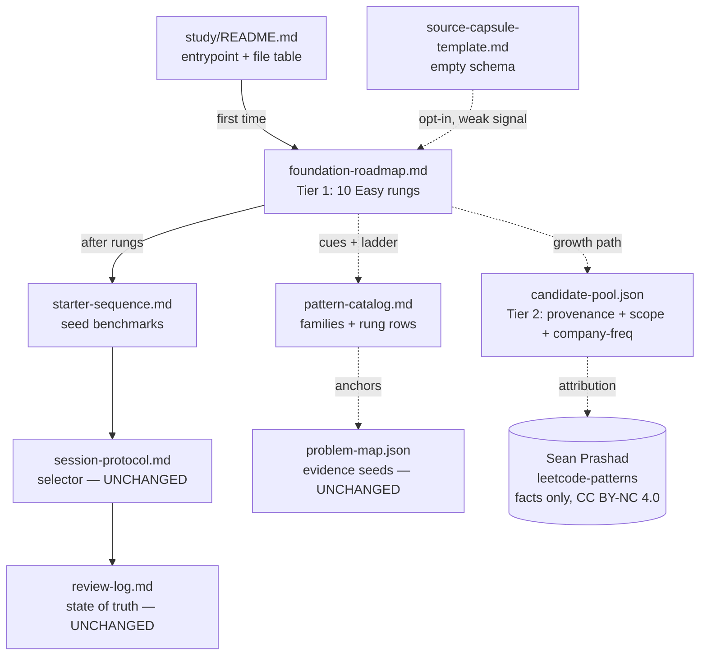

# feat: ARENA LeetCode Easy-First Bridge and Candidate Pool

## Summary

Evolve the ARENA prep system into two tiers, per the requirements doc (see origin: `docs/plans/2026-06-28-arena-leetcode-prep-strategy-requirements.md`).

- **Tier 1 — active bridge:** a new `foundation-roadmap.md` carrying ten genuinely-Easy problems (one or two per high-value foundational pattern), each with an existing local Python solution, a repo-voice one-line cue, and an explicit ladder to the ARENA seed(s) it supports. The seeds become benchmarks reached *after* their rungs, not the starting line.
- **Tier 2 — documented growth path:** a new repo-owned `candidate-pool.json` modelling pattern→problem with provenance, `scope` tags, and a general-interview-value signal (company frequency drawn from factual data), so the pool is ARENA-first now and re-sliceable to other roles later.
- **Source-capsule mechanism:** a new empty `source-capsule-template.md` with schema and instructions only — never seeded or auto-researched.

Existing docs (`starter-sequence.md`, `study/README.md`, `AGENTS.md`, `pattern-catalog.md`) get additive edits only. The session selector, hint ladder, and `review-log.md` mechanics are untouched, and the live Sum Game re-drill stays the current next action.

---

## Problem Frame

The current on-ramp is too steep for a complete beginner. `prep/arena-interview-prep/study/starter-sequence.md` opens directly on the six recovered ARENA seeds — five Medium and one Hard — and labels a Medium (LC2390) the "easiest anchor." There is no genuinely-Easy rung anywhere. The cost is visible in `review-log.md`: the only two practiced rows are both Sum Game (LC1927), both still shaky, the second solved only with guided-formula help.

Two pressures shape the fix. The seeds were recovered from August 2024 Slack screenshots, so ARENA 9.0 may not reuse them — they must be benchmarks, not the curriculum. And the user's target roles beyond ARENA are unsettled, so the pool must optimize for ARENA now while staying re-sliceable later. The remedy is to widen the on-ramp with a small easy-first bridge and a repo-owned candidate pool, while preserving the repo's reactive-growth ethos and minimal session machinery.

---

## Requirements Traceability

Carried forward from the origin requirements doc; every requirement maps to a unit below.

| Req | Summary | Covered by |
| --- | --- | --- |
| R1 | 8–12 genuinely-Easy problems, each with a local solution | U2, U1 |
| R2 | Map each bridge problem to pattern + ARENA seed it supports | U2, U1 |
| R3 | Prioritize arrays/hashing, two-pointer, sliding window, stack, prefix sums; binary search + BFS/DFS as staples | U1, U2 |
| R4 | Treat seeds as benchmarks reached after their rungs | U2, U4 |
| R5 | Preserve session mechanics; bridge adds earlier LEARN targets only | U2, U4, U5 (no change to selector/hint ladder/review-log) |
| R6 | Compact repo-owned pattern→problem pool, not a bulk import | U1 |
| R7 | Each entry: pattern, slug, difficulty, local path, URL, source, scope | U1 |
| R8 | Each entry carries a general-interview-value signal | U1 |
| R9 | Document opt-in expansion path + log signal that triggers it | U2 (Growth Path), U6 |
| R10 | Single Sean-attribution note; factual fields only | U1, U5 |
| R11 | Source-capsule schema: source, date, claim, confidence, applicability, conflicts, action | U3 |
| R12 | Ship template empty, with instructions | U3 |
| R13 | Capsules not researched/auto-populated; weak opt-in signal | U3, U6 |
| R14 | Reconcile bridge with AGENTS.md + README: one-time-seeding exception | U6, U5 |
| R15 | Keep deferred items (flashcards, simulator, prep skill) deferred | Scope Boundaries |

Acceptance examples AE1–AE4 are enforced via test scenarios in U1–U3 (see per-unit `Covers AE` tags).

---

## Key Technical Decisions

- **New files per tier, not extensions of evidence-derived files.** The bridge lives in a new `foundation-roadmap.md`, and the pool in a new `candidate-pool.json` — both under `prep/arena-interview-prep/study/`. `problem-map.json` stays close to the recovered seed packet (it is evidence, not curriculum), and `starter-sequence.md` stays the seed-benchmark sequence. This keeps provenance boundaries clean and edits atomic (see origin: Outstanding Questions → "Deferred to planning").

- **The bridge ladders by transferable pattern, not 1:1 to each seed micro-pattern.** Greedy/math (LC1753), game-theory digit-sum (LC1927), and LIS-both-sides (LC1671) have no honest Easy rung; they are reached through general derivation/scan practice rather than a fabricated easy clone. Every rung is a *real* Easy with a *real* local solution.

- **Bridge set (10 problems, all confirmed Easy in Sean's data with local Python solutions):**

  | Pattern | Easy rung(s) | Ladders toward seed |
  | --- | --- | --- |
  | Stack | LC20 Valid Parentheses | LC2390 Removing Stars |
  | Arrays/Hashing | LC1 Two Sum, LC242 Valid Anagram | LC2452 Words Within Two Edits |
  | Two-pointer | LC125 Valid Palindrome, LC977 Squares of a Sorted Array | LC1671 / LC845 mountain scans |
  | Sliding window | LC121 Best Time to Buy and Sell Stock, LC643 Maximum Average Subarray I | LC1664 one-pass state |
  | Prefix sums | LC303 Range Sum Query Immutable | LC1664 Ways to Make a Fair Array |
  | Binary search (staple) | LC704 Binary Search | general interview value |
  | BFS/DFS (staple) | LC104 Maximum Depth of Binary Tree | general interview value |

- **Role-adaptivity is tags, not role tracks.** Each pool entry carries a `scope` array (e.g. `["foundation-bridge","general-interview"]`) and a `companyFrequency` signal, so the pool can be filtered to a future role focus without any role-specific list existing now.

- **General-value signal is present for staples, null for seeds.** The six seeds are absent from Sean's dataset, so their `companyFrequency` is `null` with a note that they are valued by ARENA evidence, not company frequency. Bridge/staple entries carry real top-company frequencies pulled from `questions.json`.

- **One-time foundation seeding is a bounded exception to reactive growth.** Pre-seeding even a small bridge contradicts AGENTS.md's "do not create a larger curriculum" and the catalog's reactive-growth rule. The plan states this exception explicitly in AGENTS.md and README so the two rules do not read as contradictory; reactive growth resumes as default for everything beyond the bridge.

- **Source capsules stay empty.** The template ships with schema + instructions and zero entries. No self-seeding, no web research. Nothing in the active roadmap depends on a capsule.

- **Review-log is untouched in v1** (confirmed with user). The Sum Game re-drill stays the live next action; the bridge is available as the recommended on-ramp but does not yank the user mid-drill.

---

## High-Level Technical Design

New artifacts and how a beginner flows through them. Solid arrows = "read first / points to"; the bridge is the new entry point ahead of the seed sequence.



Dashed = reference/data relationships, not study-flow ordering. `session-protocol.md`, `review-log.md`, and `problem-map.json` are explicitly **unchanged**.

---

## Output Structure

New and modified files under `prep/arena-interview-prep/`:

```text
prep/arena-interview-prep/
├── problem-map.json                      # UNCHANGED (evidence seeds)
└── study/
    ├── README.md                         # EDIT  (U5)  file table + flow + exception
    ├── session-protocol.md               # UNCHANGED
    ├── review-log.md                     # UNCHANGED
    ├── starter-sequence.md               # EDIT  (U4)  point to bridge first; seeds = benchmarks
    ├── pattern-catalog.md                # EDIT  (U7)  foundational-rung rows + growth pointer
    ├── foundation-roadmap.md             # NEW   (U2)  Tier 1 bridge + Growth Path
    ├── candidate-pool.json               # NEW   (U1)  Tier 2 pattern→problem pool
    └── source-capsule-template.md        # NEW   (U3)  empty schema + instructions
AGENTS.md                                 # EDIT  (U6)  one-time-seeding exception
```

---

## Implementation Units

Ordered by dependency. Each is a candidate atomic commit. There is no Python test harness for these data/doc artifacts, so "test scenarios" are concrete validation checks (a short throwaway script or manual link/JSON check); the implementer should not add a permanent test framework.

### U1. Create `candidate-pool.json` (Tier 2 data backbone)

- **Goal:** A compact, repo-owned pattern→problem pool with provenance, scope tags, and a general-value signal.
- **Requirements:** R6, R7, R8, R10; partial R1/R2 (bridge entries).
- **Dependencies:** none.
- **Files:** `prep/arena-interview-prep/study/candidate-pool.json` (new).
- **Approach:** Top-level object with `version`, `purpose`, an `attribution` block crediting Sean Prashad's roadmap as curation inspiration (CC BY-NC 4.0; factual fields only — slug, difficulty, company frequency — no hint-note prose), a `scopeTags` glossary (`arena-core`, `foundation-bridge`, `general-interview`, `role-future`), and a `patterns` array. Each pattern object has `pattern`, `catalogFamily` (matching a `pattern-catalog.md` family), and `entries`. Each entry carries: `slug`, `leetcodeId`, `difficulty`, `scope` (array), `localPath`, `leetcodeUrl`, `source`, `companyFrequency` (object of top companies from `questions.json`, or `null`), `laddersTo` (seed LC ids, where applicable), and a repo-voice `cue` (our wording, not Sean's). Populate: the 10 bridge rungs (`scope` includes `foundation-bridge`; staples also `general-interview`), the six seeds + LC845 (`scope: ["arena-core"]`, `companyFrequency: null` with the ARENA-evidence note). Pull factual fields only from `/tmp/leetcode-patterns/src/data/questions.json`; do not copy Sean's `note` text.
- **Patterns to follow:** field naming and `local_paths`/`leetcode_url` style from `prep/arena-interview-prep/problem-map.json`, but do not modify that file.
- **Test scenarios:**
  - `Covers AE3.` File parses as valid JSON; a bridge entry (e.g. `valid-parentheses`) exposes pattern, `difficulty: "Easy"`, `scope` containing `foundation-bridge`, a non-null `companyFrequency`, and `laddersTo` containing the seed it supports — enough to re-slice by scope or company without rewriting.
  - Every `localPath` in the file resolves to an existing file under the repo (all 17-ish paths exist).
  - Every entry has a non-empty `leetcodeUrl` and a repo-voice `cue`; no `cue` is copied verbatim from Sean's `note` field.
  - Every `scope` value is drawn from the `scopeTags` glossary; no stray tags.
  - Each of the six seed entries has `companyFrequency: null` and the ARENA-evidence note; each bridge/staple entry has a non-null `companyFrequency`.
  - `attribution` block names Sean Prashad, the CC BY-NC 4.0 license, and "factual fields only."
- **Verification:** JSON validates; a scope filter (`foundation-bridge`) yields exactly the 10 bridge problems; an `arena-core` filter yields the seeds.

### U2. Create `foundation-roadmap.md` (Tier 1 active bridge)

- **Goal:** The easy-first ladder that is the new active curriculum, plus the documented growth path.
- **Requirements:** R1, R2, R3, R4, R9; supports R5.
- **Dependencies:** U1 (links to candidate-pool entries and mirrors their cues).
- **Files:** `prep/arena-interview-prep/study/foundation-roadmap.md` (new).
- **Approach:** Open with a short "what this is / do this first" note and the one-time-seeding-exception statement (this bridge is a single deliberate expansion; reactive growth resumes afterward). A **Bridge Ladder** table grouped by foundational pattern: each row = Easy problem, local solution link, one-line repo-voice cue, and the seed it ladders toward (the Key Technical Decisions table is the source of mapping). Add a one-line framing that LC1753, LC1927, LC1671 have no honest Easy rung and are reached by transferable skill. Add a **Growth Path** section (R9): how the pool grows from the bridge toward a fuller foundation (3–5 per pattern) or an optional Sean-curated/role-specific slice, and the explicit log signal that triggers expansion (e.g. a pattern family accumulating 3+ shaky/recurring misses in `review-log.md`). Close by pointing to `session-protocol.md` for the ongoing selector — do not restate the rotation rule (keep the protocol the single source of truth, mirroring `starter-sequence.md`).
- **Patterns to follow:** table style, cue tone, and "stop using this file as a schedule → open session-protocol.md" closing from `prep/arena-interview-prep/study/starter-sequence.md`; relative-link style (`../../../Python/<slug>.py`) from `pattern-catalog.md`.
- **Test scenarios:**
  - `Covers AE1.` Document presents, before any ARENA seed, an Easy problem per foundational pattern with its local solution link and a one-line cue, and each rung names the seed it ladders toward.
  - `Covers AE2.` LC1927 Sum Game and LC1671 are described as benchmarks reached after their rungs, not as the next "easiest" thing — the doc contains no Easy rung claiming to clone them.
  - All 10 bridge rows are present (one or two per pattern) and every local-solution link resolves to an existing `Python/*.py` file.
  - Growth Path section names a concrete `review-log.md` signal that triggers expansion.
  - Closing section points to `session-protocol.md` and does not restate the rotation rule.
- **Verification:** A reader opening the bridge sees ten Easy rungs with cues and ladders, then is handed to the unchanged selector.

### U3. Create `source-capsule-template.md` (empty mechanism)

- **Goal:** A schema + instructions for tracking weak external advice, shipped empty.
- **Requirements:** R11, R12, R13.
- **Dependencies:** none (independent of U1/U2).
- **Files:** `prep/arena-interview-prep/study/source-capsule-template.md` (new).
- **Approach:** Document the capsule schema with all six fields — `source`, `date`, `claim`, `confidence`, `applicability`, `conflicts`, `action` — each with a one-line explanation. Include a blank template block (commented or fenced) and explicit instructions: capsules are user-supplied, never researched or auto-populated by the agent; they remain weak, provenance-tagged signals that do not change the curriculum unless the user explicitly incorporates one. Zero example/seed entries.
- **Patterns to follow:** instructional doc tone from `session-protocol.md`.
- **Test scenarios:**
  - `Covers AE4.` File exists with the schema and instructions but zero filled entries, and no active-roadmap file (`foundation-roadmap.md`, `starter-sequence.md`, `candidate-pool.json`) references a capsule as a dependency.
  - All six schema fields are documented.
  - Instructions explicitly state capsules are not agent-researched or auto-populated.
- **Test expectation note:** validation is structural (fields present, no entries), not behavioral.

### U4. Edit `starter-sequence.md` to follow the bridge

- **Goal:** Reframe the seed sequence as benchmarks that come after the bridge, without changing its mechanics.
- **Requirements:** R4, R5.
- **Dependencies:** U2 (the doc it points to must exist).
- **Files:** `prep/arena-interview-prep/study/starter-sequence.md` (edit).
- **Approach:** Add a short lead-in directing first-timers to `foundation-roadmap.md` first; reframe the existing seven-unit table as the *benchmark* sequence reached after the bridge (remove/soften the "easiest anchor" framing for LC2390 so it no longer reads as the day-one start). Do not change the rotation rule, hint ladder, or selector references.
- **Patterns to follow:** existing table and "these are not days/quota" framing already in the file.
- **Test scenarios:**
  - File now points to `foundation-roadmap.md` as the first step; the link resolves.
  - The seed table is preserved (same seven units) but framed as benchmarks, not the easiest start; LC2390 is no longer labelled "easiest anchor."
  - No change to selector, rotation rule, or hint-ladder text.
- **Test expectation note:** doc-only; verified by link resolution and a diff confined to framing + the new pointer.

### U5. Edit `study/README.md` (entrypoint + file table + reconciliation)

- **Goal:** Make the new files discoverable and state the bridge's relationship to reactive growth.
- **Requirements:** R5, R9, R10, R14; preserves R15.
- **Dependencies:** U1, U2, U3 (files referenced must exist).
- **Files:** `prep/arena-interview-prep/study/README.md` (edit).
- **Approach:** Update "First time here" to send beginners to `foundation-roadmap.md` first, then `starter-sequence.md`. Add `foundation-roadmap.md`, `candidate-pool.json`, and `source-capsule-template.md` rows to the "What's Here" table. Add a one-line Sean-attribution credit (R10). Add a short note that the bridge is a one-time seeding exception and reactive growth resumes afterward (R14). Leave the "Intentionally Deferred" section unchanged (R15).
- **Patterns to follow:** existing "What's Here" table and link style in the same file.
- **Test scenarios:**
  - Table includes the three new files, each link resolving.
  - "First time here" routes to the bridge before the seed sequence.
  - A single Sean-attribution credit line is present.
  - "Intentionally Deferred" list is byte-for-byte unchanged.
- **Test expectation note:** doc-only; verified by link resolution and the deferred-section diff being empty.

### U6. Edit `AGENTS.md` (one-time-seeding exception)

- **Goal:** Reconcile the seeded bridge with the "do not create a larger curriculum" rule so they do not contradict.
- **Requirements:** R13, R14.
- **Dependencies:** U2 (the bridge it references must exist).
- **Files:** `AGENTS.md` (edit).
- **Approach:** In the ARENA Study Support section, add a sentence that the foundation bridge in `foundation-roadmap.md` is a single, already-approved one-time expansion; beyond it, the existing rule (no new curriculum/flashcards/skills/automation without explicit ask) still holds, and reactive growth (catalog rule, 1–3 representative problems per gap) is the default. Add a one-liner that source capsules are user-supplied and never agent-researched (R13).
- **Patterns to follow:** bullet style and tone of the existing ARENA Study Support / Minimal-Hint sections.
- **Test scenarios:**
  - AGENTS.md names `foundation-roadmap.md` as the bounded one-time exception and reaffirms reactive growth as default.
  - The "do not create … a larger curriculum unless the user explicitly asks" rule remains present (not deleted).
  - A line states capsules are not agent-researched.
- **Test expectation note:** doc-only; verified by presence of the exception text and retention of the original rule.

### U7. Edit `pattern-catalog.md` (foundational-rung rows + growth pointer)

- **Goal:** Co-locate the bridge's Easy rungs and cues with their pattern families, additively.
- **Requirements:** R2, R3; supports R9.
- **Dependencies:** U1, U2.
- **Files:** `prep/arena-interview-prep/study/pattern-catalog.md` (edit).
- **Approach:** For each family that has a bridge rung, add a "Foundational rung" row to its representative-problems table pointing to the Easy problem + local solution + a one-line cue (mirroring the candidate-pool cue). Promote the already-named "candidates, not seeded yet" binary-search and BFS/DFS notes into actual rung rows now that they are seeded as staples. Add a one-line pointer to `foundation-roadmap.md` (the active ladder) and `candidate-pool.json` (the growth pool) near the existing "Growing This Catalog Reactively" section. Do not restructure existing family content or the reactive-growth rule.
- **Patterns to follow:** the existing per-family representative-problems table format in the same file.
- **Test scenarios:**
  - Each bridge pattern family has a foundational-rung row whose local-solution link resolves.
  - Binary search and BFS/DFS now appear as seeded staple rungs (no longer only "named candidates").
  - A pointer to `foundation-roadmap.md` and `candidate-pool.json` is present near the reactive-growth section.
  - Existing seed-anchor rows and the reactive-growth rule are unchanged.
- **Test expectation note:** doc-only; verified by link resolution and additive-only diff.

---

## Scope Boundaries

### Deferred to follow-up work (plan-local sequencing)

- Promoting any bridge problem into the live `review-log.md` next-action — out of v1 by user decision; the Sum Game re-drill stays the live pointer. A forward pointer to the bridge may be added only when the user asks, after the current re-drill closes.

### Deferred for later (carried from origin, not built now)

- A fuller foundation (3–5 problems per pattern) or a Sean-curated 30–40 problem slice — reachable through the documented Growth Path (U2), not built now.
- Role-specific candidate tracks — unlocked once target roles are known; the `role-future` scope tag exists but is unpopulated.
- Seeding the source capsules and any external-advice research — only when the user provides sources.
- Convex flashcards, timed six-in-sixty simulator, reusable `ce`-style prep skill — already deferred in `study/README.md`, unchanged here (R15).

### Outside this effort's identity

- Not a NeetCode-150 / all-179 generic curriculum and not Sean's list with local edits. The pool is small, ARENA-shaped, and repo-owned.
- Not a change to the session selector, hint ladder, or `review-log.md` mechanics. The on-ramp is widened; the machinery is not redesigned. `session-protocol.md`, `review-log.md`, and `problem-map.json` are not modified.

---

## Open Questions

- **Cue authoring depth.** Cues are duplicated between `candidate-pool.json` and `foundation-roadmap.md`/`pattern-catalog.md`. The plan keeps them in sync by hand at this small scale; if drift becomes a problem later, a single source (the JSON) with generated docs is the natural follow-up — deferred, not solved now.
- **Bridge rung count per pattern.** Confirmed at one or two per pattern (10 total). If a beginner finds a single rung insufficient for a pattern, adding a second rung is a reactive-growth action, not a re-plan.

---

## Risks & Dependencies

- **External data path is non-repo and transient.** `/tmp/leetcode-patterns/src/data/questions.json` is a scratch clone. Company-frequency facts must be *copied into* `candidate-pool.json` at authoring time (U1); the pool must not reference the `/tmp` path at runtime. Risk: low — facts are small and embedded once.
- **Link rot across docs.** Seven files cross-link by relative path. Mitigation: every unit's test scenarios include link resolution; run a final repo-wide relative-link check before handoff.
- **License compliance.** Sean Prashad's material is CC BY-NC 4.0. Mitigation: factual fields only + single attribution note (U1, U5); no hint-note prose reused. Personal non-commercial prep use stays within the license.
- **Coherence dependency.** U2/U4/U5/U6/U7 reference files created in U1–U3. Mitigation: dependency order above; the data/template files (U1–U3) land before the docs that point to them.

---

## Sources & Research

- Origin requirements: `docs/plans/2026-06-28-arena-leetcode-prep-strategy-requirements.md` (CE brainstorm output, committed as `d5f996554`).
- Existing study system: `prep/arena-interview-prep/study/{README,session-protocol,pattern-catalog,starter-sequence,review-log}.md`.
- Evidence seeds: `prep/arena-interview-prep/problem-map.json` (six recovered seeds + adjacent LC845).
- Coaching rules: `AGENTS.md`.
- Sean Prashad `leetcode-patterns` (CC BY-NC 4.0): `src/data/questions.json` (179 problems with company-frequency facts) and `src/data/roadmaps.ts` (68-problem beginner roadmap) — structural and candidate-problem source; used for factual fields with attribution, not note reuse.
- Bridge-selection verification (this planning pass): all 10 chosen rungs confirmed `difficulty: Easy` in `questions.json` and confirmed to have a local `Python/<slug>.py` solution; the six seeds confirmed absent from Sean's dataset (hence `companyFrequency: null`).
